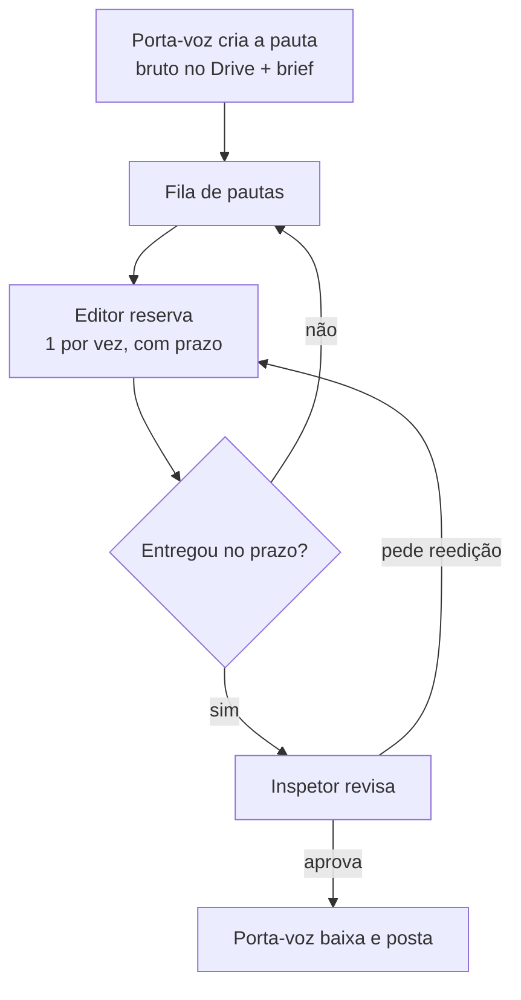

# Oficina Amarela — Especificação Técnica

> Fonte da verdade do projeto. Tudo que foi decidido até aqui, num lugar só.
> Última atualização: 27/07/2026

---

## 1. O que é

Plataforma que liga **porta-vozes** (quem tem o vídeo bruto) a **editores** (quem edita), com um **inspetor** garantindo a qualidade antes da entrega final.

Fluxo em uma frase: o porta-voz sobe o bruto e descreve o que quer; um editor pega esse trabalho da fila, reserva com prazo, edita e entrega; o inspetor aprova; o porta-voz baixa e posta.

---

## 2. Regras invioláveis

### 2.1 Palavra proibida

Histórico: a palavra "missão" chegou a ser **banida** (o Vitor apontava ligação com partido).
Em **24/07/2026 ele reverteu**, ciente do risco, e escolheu usar "missão" no texto visível.

✅ **Termo de exibição atual: MISSÃO / MISSÕES.** Ex.: "Missões disponíveis", "Missão aceita".
Nomes internos de código (`type Pauta`, `PAUTAS`, `lib/pautas.ts`, rota `/porta-voz/nova-pauta`)
seguem "pauta" de propósito — só o texto para o usuário mudou. **Não reverter pra "pauta" no texto.**

Termos políticos neutralizados: **sem "vereador"/"pré-candidato"** — usar só "Candidato/Candidata".

### 2.2 Vídeo nunca no nosso servidor

Todo arquivo de vídeo vive no **Google Drive**. O banco guarda **apenas texto** (links e metadados). Isso mantém o banco minúsculo e o custo em zero.

### 2.3 Acesso restrito ao bruto

Só o editor que **reservou** a pauta enxerga o arquivo. Ninguém vê material que não é seu.

---

## 3. Papéis

| Papel | O que faz |
|---|---|
| **Porta-voz** | Sobe bruto no Drive, cria a pauta com brief, valida a entrega, posta |
| **Editor** | Pega pauta da fila, reserva com prazo, edita, entrega o link |
| **Inspetor** | Aprova a entrega ou devolve pedindo reedição |

---

## 4. Fluxo (ordem de abastecimento)

**Quem abastece quem:** sem o passo 1 nada existe. A fila do editor é alimentada pelo porta-voz; a fila do inspetor é alimentada pela entrega do editor.

---

## 5. Máquina de estados da pauta

| Estado | Significa | Vai para |
|---|---|---|
| `disponivel` | Na fila, ninguém pegou | `reservada` |
| `reservada` | Editor pegou, prazo correndo | `entregue` ou `disponivel` (prazo venceu / cancelou) |
| `entregue` | Link enviado, aguardando inspetor | `em_revisao` |
| `em_revisao` | Inspetor analisando | `aprovada` ou `reedicao` |
| `reedicao` | Devolvida ao mesmo editor | `entregue` |
| `aprovada` | Liberada pro porta-voz | `postada` |
| `postada` | Ciclo fechado | — |

**Regra de reserva:** o editor pega **1 pauta por vez**. Só libera outra depois de entregar ou cancelar.

**Prazo:** ⚠️ pendente de decisão (assumido **24h** por ora).

---

## 6. Integração com o Google Drive

> ⚠️ **Mudou em 27/07/2026.** Era um Drive central único da Oficina Amarela; virou **Drive pessoal de cada porta-voz**.

### 6.1 Arquitetura

- **Não existe Drive central.** Cada porta-voz sobe o bruto no **próprio** Google Drive, na pasta que quiser.
- No login com Google, o porta-voz autoriza (OAuth) o app a **gerenciar permissões** dos arquivos que ele compartilhar
  (escopo `drive.file` — só os arquivos que ele explicitamente usar na Oficina Amarela, não o Drive inteiro dele).
- Esse consentimento gera um **token (com refresh) guardado no Supabase**, associado à conta do porta-voz.
- Quando o porta-voz cria uma pauta, ele informa o link/arquivo do bruto (já na pasta dele). O `drive_file_id`
  salvo na pauta é **desse** arquivo, na conta **dele**.

### 6.2 Liberação e revogação — automáticas

O site sempre age **usando o token do porta-voz dono do arquivo** (nunca uma conta central):

| Evento | Ação na API do Drive (com o token do porta-voz) |
|---|---|
| Editor reserva a pauta | **Concede** permissão de leitura ao e-mail Google do editor, no arquivo do porta-voz |
| Prazo vence | **Revoga** a permissão |
| Editor cancela | **Revoga** a permissão |
| Pauta aprovada | **Revoga** a permissão |

⚠️ **A revogação é tão crítica quanto a liberação.** Sem ela, cada editor acumula acesso permanente a tudo que já tocou.
⚠️ Se o porta-voz revogar o acesso do app ao Drive dele (fora do site) ou o token expirar sem refresh válido,
a liberação/revogação falha — precisa de um jeito de avisar ("reconecte seu Drive") nesse caso.

### 6.3 Consequência no login

Como cada compartilhamento agora depende do token **de quem sobe o bruto**:

- **Login com Google é o caminho principal** — já entrega e-mail **e** pede o escopo de Drive na mesma hora
- Quem entrar por apelido/senha **precisa conectar o Google** (login + Drive) antes de conseguir criar uma pauta
- Editores só precisam do e-mail Google (pra receber o compartilhamento) — não precisam autorizar Drive, só os porta-vozes

---

## 7. Modelo de dados

Tudo texto. Estimativa: 1 pauta ≈ 1 KB → 1.000 pautas ≈ 1 MB. O plano grátis do Supabase (500 MB) comporta ~500 mil pautas.

### `usuarios`

| Campo | Tipo | Nota |
|---|---|---|
| `id` | uuid | PK |
| `apelido` | text | único |
| `email_google` | text | obrigatório (necessário pro Drive) |
| `papel` | enum | `porta_voz` · `editor` · `inspetor` |
| `nivel` | enum | `aspirante` · `confrade` · `veterano` · `mestre` |
| `nota` | numeric | ⚠️ critério a definir |
| `drive_refresh_token` | text (criptografado) | só porta-voz — token OAuth do Drive **dele**, usado pra liberar/revogar acesso |
| `drive_conectado` | boolean | false se o token expirou/foi revogado — mostra "reconecte seu Drive" |
| `criado_em` | timestamp | |

### `pautas`

| Campo | Tipo | Nota |
|---|---|---|
| `id` | uuid | PK |
| `porta_voz_id` | uuid | FK → usuarios |
| `titulo` | text | |
| `formato` | enum | `short` (9:16) · `longo` (16:9) |
| `brief_tom` / `brief_cor` / `brief_fonte` / `brief_refs` | text | o "ouro" pro editor |
| `drive_file_id` | text | id do arquivo no Drive |
| `links_extras` | text[] | brutos específicos a incluir |
| `status` | enum | ver máquina de estados |
| `reservada_por` | uuid | FK → usuarios |
| `reservada_ate` | timestamp | prazo |
| `criada_em` | timestamp | |

### `entregas`

| Campo | Tipo | Nota |
|---|---|---|
| `id` | uuid | PK |
| `pauta_id` | uuid | FK → pautas |
| `editor_id` | uuid | FK → usuarios |
| `link_video` | text | link do editado |
| `entregue_em` | timestamp | |
| `resultado` | enum | `pendente` · `aprovada` · `reedicao` |
| `notas_inspetor` | text | o que corrigir |

### Segurança (RLS no Supabase)

- Editor só lê pautas `disponivel` **ou** as que ele reservou
- Editor nunca lê `drive_file_id` de pauta que não é dele
- Porta-voz só lê as próprias pautas
- Inspetor lê tudo que está `entregue`/`em_revisao`

---

## 8. Telas

### Feitas ✅ (interface pronta, dados fake)

| Rota | O que tem |
|---|---|
| `/` | Boas-vindas + escolher papel (Porta-voz / Editor) |
| `/login` | Painel de marca (PC) + Google + apelido/senha |
| `/editor` | **Fila em lista**: candidato em destaque (avatar, cargo, local) + brief + pressão (prazo) + reservar; pauta aceita com contador; entrega |
| `/agenda` | Disponibilidade da semana clicável + trabalhos em andamento (barra = % do prazo decorrido, contador vivo) |
| `/perfil` | Perfil do editor estilo LinkedIn: capa, avatar, stats, portfólio, histórico, nível, conquistas, disponibilidade, na mesa agora |
| `/porta-voz` | Minhas pautas + status |
| `/porta-voz/nova-pauta` | Formulário passo a passo (5 passos) |
| `/candidato/[slug]` | Perfil do candidato: cargo, local, bio, stats, pautas dele |
| `/inspetor` | Fila de entregas (`em_revisao`), aprovar (`aprovada`) ou pedir reedição com nota (`reedicao`) |
| `/porta-voz/perfil` | Perfil do porta-voz: identidade, stats, missões criadas, histórico |

### Faltam ❌

| Rota | O que precisa | Prioridade |
|---|---|---|
| `/hub` | Hub dos editores (ver seção 13) | visão |
| `/criar-conta` | Cadastro | junto com o login real |

### 8.1 Formulário de nova pauta (passo a passo, não tudo de uma vez)

1. **O vídeo** — link do Drive com o bruto
2. **Extras** — links/brutos específicos que quer no vídeo
3. **O estilo** — o que gosta (tom, cor, fonte, referências)
4. **Contexto** — motivo/motivação
5. **Prazo e formato** — short ou longo, quando precisa

---

## 9. Identidade visual

| Item | Decisão |
|---|---|
| Nome | **Oficina Amarela** (antigamente Confraria) |
| Cor base | **Dourado/amarelo** (`#f4ce1f`) — é a cor da marca real |
| Cor secundária | Prata só como detalhe discreto (linhas, texto secundário) |
| Fundo | **Preto texturizado** (trama diagonal + granulado) |
| Prioridade | **PC primeiro**, ótimo no celular |
| Tipografia | **Cinzel** (títulos) + **Sora** (interface) |
| Marca | **Onça-pintada dentro de uma casa/celeiro**, dourado no preto |

> **Rebrand em 12/08/2026: o mascote deixou de ser tigre e virou onça-pintada**
> — animal brasileiro, combina melhor com a pegada do produto.
>
> ⚠️ **A troca está pela metade.** O texto e os emojis já são onça, mas a arte
> ainda é o tigre antigo. Falta o designer entregar:
>
> - `public/emblema.png` — 5 referências no código: `components/logo.tsx` (o
>   logo do header, reusado em várias telas), o favicon em `app/layout.tsx` e a
>   marca d'água de 3 perfis. Todas apontam pro mesmo arquivo, então **trocar a
>   imagem resolve tudo de uma vez, sem mexer em código**.
> - `public/emblema-fundo.png` e `public/logo-completo.png` — confirmados
>   órfãos (nenhum import), mas também são tigre. Trocar ou apagar.
>
> Obs.: o emblema veio em PNG ~370px. Se for usar gigante (banner, camiseta),
> pedir SVG ou PNG maior junto com a arte nova.
>
> Nota sobre o emoji: usamos 🐆 porque **não existe emoji de onça-pintada**.
> No Unicode ele é oficialmente "leopard" — é o mais próximo que dá.

Tokens em `app/globals.css` (`@theme`). Amarelo da marca: `#f4ce1f` (core), `#fbe9a6` (claro), `#a9840e` (escuro).

---

## 10. Stack

- **Next.js 16** (App Router, Turbopack) + **React 19** + **TypeScript**
- **Tailwind 4** — tokens via `@theme`, componentes em `@layer components`
- **Supabase** — auth (apelido/senha + Google) + Postgres + RLS
- **Google Drive API** — liberação/revogação de acesso

⚠️ Next 16 tem breaking changes: consultar `node_modules/next/dist/docs/` antes de codar (regra do `AGENTS.md`).

---

## 11. Pendências

### Bloqueiam o próximo passo

- [ ] **Conta do Drive é Gmail comum ou Google Workspace?** (muda o método de autenticação)
- [ ] Criar projeto no Supabase + Google Cloud → me passar as chaves (ver `SETUP-GOOGLE.md`)

### Não bloqueiam, mas precisam de resposta

- [ ] **Prazo padrão** de reserva (assumido 24h)
- [ ] **Critério da nota** do editor
- [ ] O que desbloqueia cada **nível** (Aspirante → Mestre)
- [ ] Referências visuais (prints do Mobbin / Dark Mode Design)
- [ ] A palavra "Pauta" está aprovada?

---

## 13. Visão — Reputação e Hub (registrar, não construir ainda)

> Ideias do Vitor pra depois. Foco agora continua: pegar serviços, fila, perfil do
> editor e perfil do candidato. Só editor por enquanto (depois: design, coordenador…).

### 13.1 Métrica de pontos (reputação do editor)

A nota/reputação sai de comportamento, não é manual:

| Fator | Efeito | Peso |
|---|---|---|
| Entregar no prazo | **+** pontos | alto |
| **Constância** (entregar seguido, sem sumir) | **+** pontos | **o mais importante** |
| Volume de vídeos entregues | **+** pontos | médio |
| Atrasar muito / não entregar | **−** pontos | alto |
| Contribuir no Hub (material útil) | **+** pontos | médio |

- Constância é o pilar: manter ritmo vale mais que um pico isolado.
- Reputação alimenta o **nível** (Aspirante → Mestre) e desbloqueia trabalhos.

### 13.2 Hub dos editores

Ambiente onde os editores agregam material uns pros outros. Contribuir dá pontos.
Cada post é de um tipo:

- **Fontes** que usam (tipografia)
- **Layouts** de vídeo (como montar)
- **Scripts** interessantes
- **Fórmulas** / receitas de edição

Quanto mais o editor agrega, melhor o ambiente e mais reputação ele ganha.
Futuro: mesmo hub para design, coordenação e outros papéis.

---

## 12. Documentos relacionados

- `PLANO.md` — plano e roadmap
- `SETUP-GOOGLE.md` — passo a passo do Supabase + Google Cloud
- `PESQUISA-F1.md` — pesquisa dos concorrentes
- `referencia-login-v1.html` — protótipo HTML antigo
- Obsidian: `Informações Úteis/Plataforma Oficina Amarela — Ferramentas e Sites.md`
